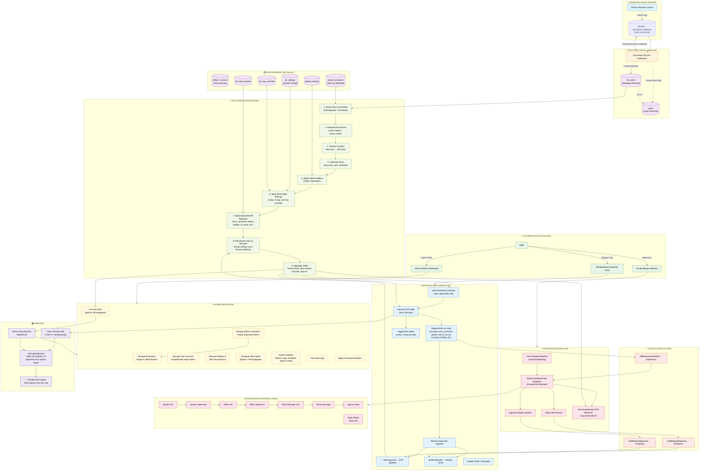

# DTR System Flowchart

```mermaid
flowchart TB
    subgraph BIOMETRICS["📡 BIOMETRICS DATA SOURCE"]
        ZK["ZKTeco Biometric Device"]
        ZKMDB[("MySQL: personnel_employee<br/>iclock_transaction")]
        ZK -->|Punch Logs| ZKMDB
    end

    subgraph SYNC["🔄 DATA SYNC (Artisan Command)"]
        CMD["php artisan dtr:sync-employees"]
        CMD -->|Reads personnel_employee| ZKMDB
        CMD -->|Creates/Updates| DTR_USERS
        CMD -.->|--create-users flag| USERS
    end

    subgraph MAIN_DB["🗄️ MAIN DATABASE (SQL Server)"]
        DTR_USERS[("dtr_users<br/>(Employee Records)")]
        USERS[("users<br/>(Login Accounts)")]
        OFFICES[("offices / sections<br/>(Org Structure)")]
        TRANSACTIONS[("iclock_transaction<br/>(read via zkbiotime)")]
        SETTINGS[("dtr_settings<br/>(System Config)")]
        HOLIDAYS[("global_holidays")]
        DAY_OVERRIDES[("dtr_day_overrides")]
        EDIT_REQUESTS[("dtr_edit_requests")]
    end

    subgraph AUTH["🔐 AUTHENTICATION & ACCESS"]
        LOGIN["/login"]
        LOGIN -->|Regular User| USER_DASH["/dtr/dashboard (Calendar View)"]
        LOGIN -->|Super Admin| ADMIN_DASH["/admin (Admin Dashboard)"]
        LOGIN -->|Supervisor| SUP_VIEW["/dtr (Employee Selector)"]
    end

    subgraph REGULAR_USER_FLOW["👤 REGULAR USER WORKFLOW"]
        direction TB
        VIEW_DASH["View Dashboard Calendar<br/>Color-coded daily slots"]
        VIEW_DTR["View My DTR Table<br/>/dtr or /dtr/show"]
        REQ_EDIT["Request Edit on a Day<br/>(12 types: time_correction,<br/>absent, wfh, to, so, ob,<br/>on_leave, holiday, etc.)"]
        WAIT_APPROVAL["Wait for Supervisor Approval"]
        EDIT_APPROVED["✅ Edit Approved → DTR Updated"]
        EDIT_REJECTED["❌ Edit Rejected → Reason Given"]
        TOGGLE_WW["Toggle Work Week<br/>(4-day / 5-day per day)"]
        PROFILE["Update Profile / Password"]

        VIEW_DASH --> VIEW_DTR
        VIEW_DTR --> REQ_EDIT
        VIEW_DTR --> TOGGLE_WW
        REQ_EDIT --> WAIT_APPROVAL
        WAIT_APPROVAL --> EDIT_APPROVED
        WAIT_APPROVAL --> EDIT_REJECTED
    end

    subgraph SUPERVISOR_FLOW["👮 SUPERVISOR WORKFLOW"]
        direction TB
        SUP_PENDING["View Pending Requests<br/>/supervisor/pending"]
        SUP_REVIEW["Review Employee Edit Requests<br/>(Grouped by Employee)"]
        SUP_APPROVE["Approve (Single or Batch)"]
        SUP_REJECT["Reject with Reason"]
        SUP_VIEW_DTR["View Subordinate DTRs<br/>/dtr/show?emp=X&month=M"]

        SUP_PENDING --> SUP_REVIEW
        SUP_REVIEW --> SUP_APPROVE
        SUP_REVIEW --> SUP_REJECT
        SUP_REVIEW --> SUP_VIEW_DTR
    end

    subgraph ADMIN_FLOW["⚙️ ADMIN WORKFLOW"]
        direction TB
        ADMIN_EMP["Manage Employees<br/>Assign to Office/Section"]
        ADMIN_ORG["Manage Offices & Sections<br/>Assign Supervisors/OICs"]
        ADMIN_USERS["Manage User Accounts<br/>Grant/Revoke Super Admin"]
        ADMIN_HOLIDAYS["Manage Holidays &<br/>Work Suspensions"]
        ADMIN_WW["Configure Work Week<br/>(Global + Per-Employee)"]
        ADMIN_SETTINGS["System Settings<br/>(Name, Logo, Schedule,<br/>Agency Head)"]
        ADMIN_LOGS["View Audit Logs"]
        ADMIN_PWRESET["Approve Password Resets"]
        ADMIN_PRINT["Print All DTRs<br/>(Bulk for All Employees)"]

        ADMIN_ORG --> ADMIN_EMP
    end

    subgraph DTR_COMPUTE["🧮 DTR COMPUTATION ENGINE"]
        direction TB
        FETCH_PUNCHES["1. Query iclock_transaction<br/>forEmployee() + forPeriod()"]
        DEDUP["2. Deduplicate Punches<br/>(same minute + punch_state)"]
        CLASSIFY["3. Classify Punches<br/>AM in/out → PM in/out"]
        CALC_HOURS["4. Calculate Hours<br/>total_hours, late, undertime"]
        APPLY_HOLIDAY["5. Apply Global Holidays<br/>(whole_day/am/pm)"]
        APPLY_WW["6. Apply Work Week Settings<br/>(4-day / 5-day / per-day override)"]
        APPLY_EDITS["7. Apply Approved Edit Requests<br/>(time_correction, absent,<br/>halfday, on_leave, etc.)"]
        RECALC["8. Recompute Hours & Remarks<br/>Recalc halfday hours<br/>Recalc undertime"]
        AGGREGATE["9. Aggregate Totals<br/>Present days, total minutes,<br/>total late, total UT"]

        FETCH_PUNCHES --> DEDUP --> CLASSIFY --> CALC_HOURS
        CALC_HOURS --> APPLY_HOLIDAY --> APPLY_WW --> APPLY_EDITS --> RECALC --> AGGREGATE
    end

    subgraph NOTIFICATIONS["🔔 NOTIFICATION SYSTEM"]
        NOTIF_SUBMIT["EditRequestSubmitted → Supervisors"]
        NOTIF_APPROVED["EditRequestApproved → Employee"]
        NOTIF_REJECTED["EditRequestRejected → Employee"]
    end

    subgraph PRINTING["🖨️ PRINTING"]
        USER_PRINT["User: Print My DTR<br/>CTRL+P / window.print()"]
        ADMIN_PRINT_ACTION["Admin: Print All DTRs<br/>/dtr/print-all"]
        CSS_PRINT["CSS @media print<br/>Hides nav, buttons, UI<br/>Optimizes A4 2-column layout"]
        PDF["📄 Printed DTR Output<br/>(Civil Service Form No. 48)"]

        USER_PRINT --> CSS_PRINT --> PDF
        ADMIN_PRINT_ACTION --> CSS_PRINT
    end

    subgraph SUPERVISOR_HIERARCHY["📋 SUPERVISOR APPROVAL CHAIN"]
        SECTION_OIC["Section OIC"]
        SECTION_SUP["Section Supervisor"]
        OFFICE_OIC["Office OIC"]
        OFFICE_SUP["Office Supervisor"]
        SR_MGR_OIC["Senior Manager OIC"]
        SR_MGR["Senior Manager"]
        AGENCY_HEAD["Agency Head"]
        SUPER_ADMIN["Super Admin<br/>(Sees All)"]

        SECTION_OIC --> SECTION_SUP
        SECTION_SUP --> OFFICE_OIC
        OFFICE_OIC --> OFFICE_SUP
        OFFICE_SUP --> SR_MGR_OIC
        SR_MGR_OIC --> SR_MGR
        SR_MGR --> AGENCY_HEAD
    end

    %% === CONNECTIONS ===

    %% Biometrics → Sync → DB
    ZKMDB --> CMD
    DTR_USERS -.->|bio_id| USERS

    %% DB → DTR Computation
    DTR_USERS --> FETCH_PUNCHES
    TRANSACTIONS --> FETCH_PUNCHES
    SETTINGS --> APPLY_WW
    DAY_OVERRIDES --> APPLY_WW
    HOLIDAYS --> APPLY_HOLIDAY
    EDIT_REQUESTS --> APPLY_EDITS

    %% Auth → User Flows
    USER_DASH --> REGULAR_USER_FLOW
    SUP_VIEW --> SUPERVISOR_FLOW
    ADMIN_DASH --> ADMIN_FLOW

    %% DTR Computation → Views
    AGGREGATE --> VIEW_DASH
    AGGREGATE --> VIEW_DTR
    AGGREGATE --> SUP_VIEW_DTR
    AGGREGATE --> ADMIN_PRINT

    %% Edit Request Flow
    REQ_EDIT --> NOTIF_SUBMIT
    NOTIF_SUBMIT --> SUP_REVIEW
    SUP_APPROVE --> NOTIF_APPROVED
    SUP_REJECT --> NOTIF_REJECTED
    NOTIF_APPROVED --> EDIT_APPROVED
    NOTIF_REJECTED --> EDIT_REJECTED
    EDIT_APPROVED --> RECALC

    %% Supervisor Hierarchy
    SUP_REVIEW --> SUPERVISOR_HIERARCHY

    %% Printing
    VIEW_DTR --> USER_PRINT
    ADMIN_PRINT_ACTION --> ADMIN_FLOW
    ADMIN_PRINT --> ADMIN_PRINT_ACTION

    %% Styles
    classDef biometrics fill:#e1f5fe,stroke:#0288d1,color:#000
    classDef sync fill:#fff3e0,stroke:#f57c00,color:#000
    classDef database fill:#f3e5f5,stroke:#7b1fa2,color:#000
    classDef auth fill:#e8f5e9,stroke:#388e3c,color:#000
    classDef userFlow fill:#e3f2fd,stroke:#1565c0,color:#000
    classDef supervisorFlow fill:#fce4ec,stroke:#c62828,color:#000
    classDef adminFlow fill:#fff8e1,stroke:#f9a825,color:#000
    classDef compute fill:#f1f8e9,stroke:#558b2f,color:#000
    classDef notify fill:#fbe9e7,stroke:#d84315,color:#000
    classDef print fill:#ede7f6,stroke:#4527a0,color:#000
    classDef hierarchy fill:#fce4ec,stroke:#ad1457,color:#000

    class ZK,ZKMDM biometrics
    class CMD sync
    class DTR_USERS,USERS,OFFICES,TRANSACTIONS,SETTINGS,HOLIDAYS,DAY_OVERRIDES,EDIT_REQUESTS database
    class LOGIN,USER_DASH,ADMIN_DASH,SUP_VIEW auth
    class VIEW_DASH,VIEW_DTR,REQ_EDIT,WAIT_APPROVAL,EDIT_APPROVED,EDIT_REJECTED,TOGGLE_WW,PROFILE userFlow
    class SUP_PENDING,SUP_REVIEW,SUP_APPROVE,SUP_REJECT,SUP_VIEW_DTR supervisorFlow
    class ADMIN_EMP,ADMIN_ORG,ADMIN_USERS,ADMIN_HOLIDAYS,ADMIN_WW,ADMIN_SETTINGS,ADMIN_LOGS,ADMIN_PWRESET,ADMIN_PRINT adminFlow
    class FETCH_PUNCHES,DEDUP,CLASSIFY,CALC_HOURS,APPLY_HOLIDAY,APPLY_WW,APPLY_EDITS,RECALC,AGGREGATE compute
    class NOTIF_SUBMIT,NOTIF_APPROVED,NOTIF_REJECTED notify
    class USER_PRINT,ADMIN_PRINT_ACTION,CSS_PRINT,PDF print
    class SECTION_OIC,SECTION_SUP,OFFICE_OIC,OFFICE_SUP,SR_MGR_OIC,SR_MGR,AGENCY_HEAD,SUPER_ADMIN hierarchy
```
